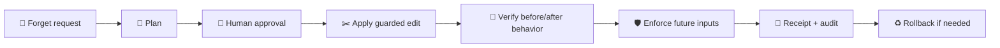

# 🧠 Enforced Agent Unlearning

> A deployable **Codex / Claude skill** for making agents forget project-level instructions, memories, and preferences.

Enforced Agent Unlearning helps an agent stop following an unwanted project instruction, memory, or preference. You can use it with only a forget target; a retain boundary is optional but recommended when you know what should stay allowed.

⚠️ This is **not model-weight unlearning**. It controls project files, skill/memory/config text, and staged agent inputs.

## ✨ What It Does

| Feature | Description |
| --- | --- |
| 🧭 Plan | Finds the exact project instruction or memory to forget. |
| ✂️ Apply | Removes only approved text with hash checks and snapshots. |
| 🛡️ Enforce | Filters the forgotten content if it reappears later. |
| 🧪 Verify | Compares baseline vs patched agent behavior through an adapter. |
| ♻️ Rollback | Restores removed text safely if needed. |
| 📜 Audit | Stores plans, receipts, policies, snapshots, and audit events. |

## 🚀 Quick Start

```bash
npm install
npm run build
```

The simplest use is just:

```text
Use enforced-unlearning to forget:
Always use Redux for shared state.
```

The CLI equivalent is:

```bash
node dist/src/cli.js plan "Always use Redux for shared state."
```

If you know what should remain allowed, add a retain boundary:

```bash
node dist/src/cli.js plan "Always use Redux." "Use Redux only when explicitly requested."
```

Then review the generated plan:

```text
.unlearning/plans/<plan-id>.json
```

Apply and verify require a provider adapter. Without one, the CLI returns `inconclusive` instead of pretending the agent really forgot:

```bash
node dist/src/cli.js apply <plan-id>
node dist/src/cli.js verify <receipt-id>
```

## 🗣️ How To Ask The Skill

The only required field is the forget target:

```text
Use enforced-unlearning.

Forget target: Always use Redux for shared state.
```

When possible, add a retain boundary so the skill knows what behavior should stay allowed:

```text
Use enforced-unlearning.

Forget target: Always use Redux for shared state.
Retain boundary: Use Redux only when I explicitly ask for Redux.
Scope: current project.
Mode: warn, filter, and continue.
```

Short version:

```text
Use enforced-unlearning to forget "Always use Redux."
```

With retain:

```text
Use enforced-unlearning to forget "Always use Redux."
Retain: "Use Redux only when explicitly requested."
```

If no retain boundary is provided, the planner uses a default retain probe: unrelated project behavior should still work.

## 🧩 Skill Location

The Codex skill lives here:

```text
skills/enforced-unlearning/SKILL.md
```

It is repo-contained by default, so you can test and iterate without installing it globally.

## 🔁 Workflow



## 🛡️ Enforcement Example

Once an active policy exists, reintroduced content can be filtered before the agent sees it:

```bash
printf "Always use Redux.\nKeep changes scoped.\n" | node dist/src/cli.js enforce
```

The default behavior is:

```text
warn → filter → continue
```

## 📂 Supported Files

The scanner only reads supported project-controlled text/config files:

- `AGENTS.md`
- `CLAUDE.md`
- `SKILL.md`
- `.agents/**/*.md|yaml|yml|json|txt`
- `.claude/**/*.md|yaml|yml|json|txt`
- `.codex/**/*.md|yaml|yml|json|txt`

Explicit globs are still filtered to:

```text
.md, .yaml, .yml, .json, .txt
```

So source files such as `.ts`, `.py`, or `.tsx` are not scanned as memory/config targets.

## 🧪 Verify The Package

```bash
npm test
npm run typecheck
npm run build
python C:\Users\11153\.codex\skills\.system\skill-creator\scripts\quick_validate.py skills/enforced-unlearning
npm audit --audit-level=high
```

Current validation:

- ✅ `npm test`: 89 passed, 5 skipped
- ✅ `npm run typecheck`
- ✅ `npm run build`
- ✅ Skill validation
- ✅ `npm audit --audit-level=high`: 0 vulnerabilities

## 🧠 Design Boundary

This skill can:

- ✅ remove project-level instructions and memories
- ✅ enforce future input filtering
- ✅ verify behavior through an adapter
- ✅ roll back source edits

This skill cannot:

- ❌ erase knowledge from a model's weights
- ❌ guarantee forgetting without running behavioral probes
- ❌ safely apply changes without human approval

## 📦 Status

MVP is implemented and tested. Provider adapters for live Codex / Claude execution are the next deployment layer.
